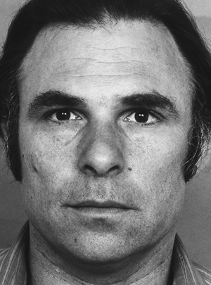
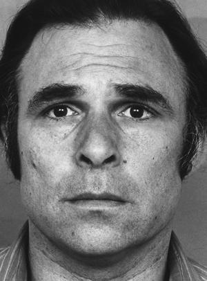
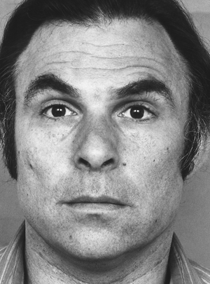
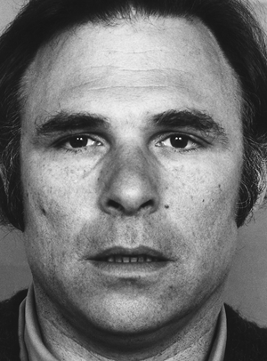

FACS-based Facial Expression Animation in Unity
===

This is the final project for the ["Sistemas Gráficos 3D" (3D Graphics Systems) course](http://lvelho.impa.br/i3d19/).


## Overview

In this project, simple facial expression animation was implemented in Unity via a `FaceManager.cs` script on a mesh with
Blendshapes for specific Action Units, specified by the Facial Action Coding System (FACS).

From another script, you can then use:

```c#
...
FaceManager fm;

void Start() {
    ...
    fm = GetComponent<FaceManager>();
    ...
}

void Update() {
    ...
    fm.ShowExpression(FaceExpression.Happiness, // facial expression
                      500,                      // animation duration (ms)
                      10,                       // apex duration (ms)
                      1);                       // intensity
    ...
}
```

Additionally, the face can move its mouth to simulate speech, like so:

```c#
fm.StartSpeaking(750); // speech animation duration (ms)
...
fm.StopSpeaking(); // speech animation duration (ms)
```

## Animation

We need to produce an animation given the starting point and the final point along with the desired duration. A trivial solution is
linear interpolation, but it doesn't produce smooth movement when chaining expressions; in order to overcome this, we pass the output
of the linear interpolation to a function $f : [0, 1] \rightarrow [0, 1]$ such that:

- $f$ is derivable
- $f(0) = 0$
- $f(1) = 1$
- $f'(0) = f'(1) = 0$

For example:

- $f(t) = \cos((t-1)\pi)/2 + 1/2$
- $f(t) = -2t^3 + 3t^2$

Additionally, after finishing this animation, the face stays in "rest" for a given duration, forming the expression's apex.

## FACS / EM-FACS

The [Facial Action Coding System (FACS)](https://www.paulekman.com/product/facs-manual/) developed by Paul Ekman
encodes facial activity into _Action Units_ (AUs); here are some examples:

|       AU 0              |                  AU 1                 |         AU 2            |      AU 25               |
|:-----------------------:|:-------------------------------------:|:-----------------------:|:------------------------:|
| Neutral face            | Raises the inner part of the eyebrows | Arches the eyebrows     | Parts the lips           |
| { width=3cm }| { width=3cm }               | { width=3cm } | { width=3cm } |

In the current implementation, we use the following AUs (plus AU 0, which is the lack of any other AUs):

- AU 4
- AU 1
- AU 2
- AU 5
- AU 7
- AU 6
- AU 9
- AU 10
- AU 17
- AU 15
- AU 25
- AU 26
- AU 27
- AU 16
- AU 20
- AU 12
- AU 23
- AU 24

However, this is still not enough to determine the desired expression, given some emotion - for this, we use Emotional FACS (EM-FACS),
which maps certain combinations of AUs to one of the six basic emotions:

- Happiness
- Sadness
- Surprise
- Fear
- Anger
- Disgust

The final facial expression is then determined by a lookup table based on EM-FACS, mapping each of the basic emotions to a list of
activation weights for selected AUs, and then selecting the list of weights $u$ that minimizes $\lVert u - v \rVert_2$ where $v$ are
the current weights.

## Additional Features

The interface has some details:

- If `ShowExpression` is called when an expression animation is in progress, the call will be added to a stack to be run once the current
animation finishes;
- Stop expressions by using `StopExpression();` - this is the same as `ShowExpression(FaceExpression.Neutral, ...);` but without adding to
the expression stack;
